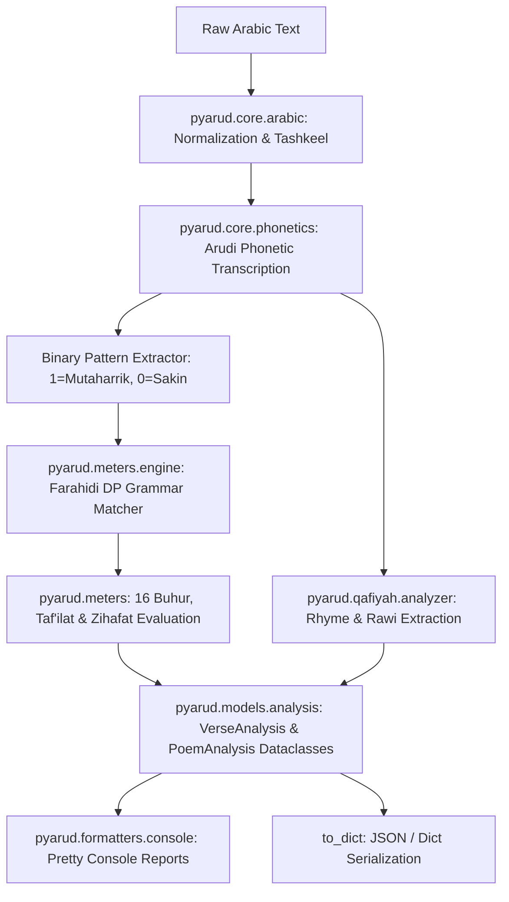

# Technical Architecture

PyArud is designed as a modular, layered pipeline. It separates pure Arabic orthography and phonetics from the mathematical prosodic meter scansion engine and rhyme analysis.

---

## 1. Zero-Dependency Core (`pyarud.core`)

The `pyarud.core` package handles all Arabic text processing without external libraries:

- **`arabic.py`**:
  - `is_haraka`, `is_shadda`, `is_sukun`, `is_tanween`, `is_sun_letter`, `is_moon_letter`.
  - Orthographic normalization (`normalize_orthography`, `strip_tashkeel`, `strip_tatweel`, `strip_punctuation`).
- **`phonetics.py` (`ArudiConverter`)**:
  - Pronominal Ha' saturation (إشباع هاء الغائب).
  - Rhyme saturation (إشباع القافية).
  - Implicit letter expansion (`CHANGE_LST`: هذا $\to$ هاذا, لكن $\to$ لاكن, etc.).
  - Sun/Moon letter assimilation (`الـ` + شمسية).
  - Hamzat Wasl deletion (`واستغفر` $\to$ `وَسْتَغْفَرَ`).
  - Converts text to Arudi script and binary pattern (`1` for Mutaharrik, `0` for Sakin).

---

## 2. Deterministic Farahidi Engine (`pyarud.meters`)

The scansion engine uses Farahidi's dynamic programming grammar rules:

- **`Tafeela` (`tafeela.py`)**:
  - Models the 8 primary Taf'ilat (`فعولن`, `فاعلن`, `مفاعيلن`, `مستفعلن`, `متفاعلن`, `مفاعلتن`, `مفعولات`, `فاع لاتن`).
  - Defines allowed Zihafat & Ilal per foot type.
- **`Bahr` (`bahr.py`)**:
  - Implements all 16 classical Buhur:
    *الطويل, المديد, البسيط, الوافر, الكامل, الهزج, الرجز, الرمل, السريع, المنسرح, الخفيف, المضارع, المقتضب, المجتث, المتقارب, المتدارك*
  - Models sub-variations: *Tam (تام), Majzoo (مجزوء), Mashtoor (مشطور), Manhook (منهوك), Mukhalla' (مخلع)*.
- **`FarahidiEngine` (`engine.py`)**:
  - Exact dynamic programming grammar parser.
  - Matches binary sequences against valid meter foot sequences.
  - Determines optimal foot boundaries, defect names, and confidence scores.

---

## 3. Science of Rhyme (`pyarud.qafiyah`)

- **`QafiyahAnalyzer`**:
  - Extracts the exact classical Qafiyah boundary (from the last sukun to the preceding mutaharrik and sukun before it).
  - Identifies the **Rawi (الروي)** and its vocalization (مطلقة / مقيدة / مضمومة / مفتوحة / مكسورة).
  - Detects **Wasl (الوصل)**, **Khuruj (الخروج)**, **Ridf (الردف)**, **Tasees (التأسيس)**, and **Dakhil (الدخيل)**.
  - Classifies rhyme rhythm into classical categories (*Al-Mutawatir, Al-Mutadarak, Al-Mutarakib, Al-Mutakawis, Al-Mutaradif*).

---

## 4. Models & Typed Data Flow (`pyarud.models`)

PyArud is fully typed (PEP 561) using Python dataclasses:

- **`VerseAnalysis`**: Contains Sadr & Ajuz analyses, overall meter, score, and Qafiyah analysis.
- **`ShatrAnalysis`**: Contains Arudi text, binary pattern, foot analyses, and defect list.
- **`FootAnalysis`**: Contains foot name, status (`ok` / `defective`), defect name, expected pattern, and segment.
- **`PoemAnalysis`**: Aggregates multi-verse poems, majority meter vote, and average confidence.
